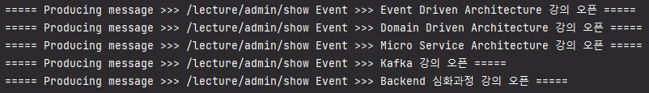

# MSA - Kafka Producer & Consumer

`현재 접근하신 Repository는 강의 오픈 Producer Server 입니다.`

### [Kafka Broker Link](https://github.com/powerstar13/Kafka-msa-topic)
Port: 9092
### [Topic: 강의 오픈 - Producer Server Link](https://github.com/powerstar13/Kafka-msa-topic/tree/develop/KafkaLecture)
Port: 8083
- 강의 노출 설정 API 경로 --> /lecture/admin/show
### [Topic: 강의 오픈 - Consumer Server Link](https://github.com/powerstar13/Kafka-msa-topic/tree/develop/KafkaMember)
Port: 8081

```java
// KafkaProducerService --> Kafka Topic 발행 서비스
package study.kafka.producer.infrastructure.kafka;

// LectureAdminHandler.changeLectureShowYn() --> 강의 노출 여부 Topic 발행
package study.kafka.producer.presentation.handler;
```

