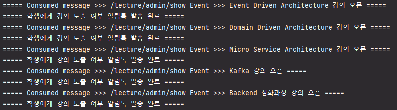

# MSA - Kafka Producer & Consumer

`현재 접근하신 Repository는 강의 오픈 Consumer Server 입니다.`

### [Kafka Broker Link](https://github.com/powerstar13/Kafka-msa-topic)
Port: 9092
### [Topic: 강의 오픈 - Producer Server Link](https://github.com/powerstar13/Kafka-msa-topic/KafkaLecture)
Port: 8083
- 강의 노출 설정 API 경로 --> /lecture/admin/show
### [Topic: 강의 오픈 - Consumer Server Link](https://github.com/powerstar13/Kafka-msa-topic/KafkaMember)
Port: 8081

```java
// KafkaConsumerConfig --> Kafka Consumer 환경 설정
package study.kafka.consumer.infrastructure.config;

// KafkaConsumerService --> Kafka Topic 구독 서비스
package study.kafka.consumer.infrastructure.kafka;
```

