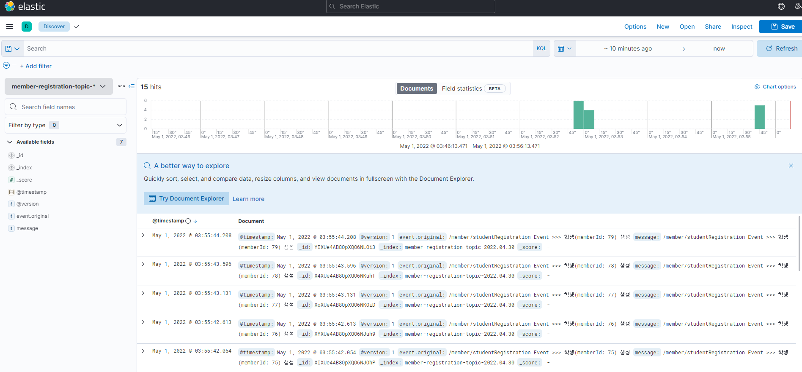
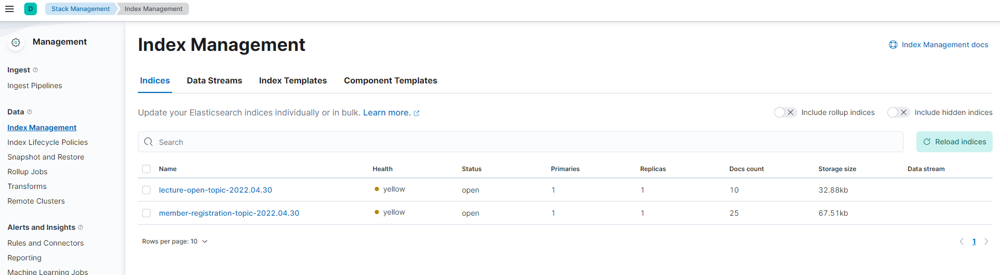

# MSA - Kafka Producer & Consumer

`현재 접근하신 Repository는 강의 오픈 Kafka Broker Server 입니다.`

### [Kafka Broker Link](https://github.com/powerstar13/Kafka-msa-topic)

### [Topic: 강의 오픈 - Producer Server Link](https://github.com/powerstar13/Kafka-msa-topic/tree/develop/KafkaLecture)
Port: 8083
- 강의 노출 설정 API 경로 --> /lecture/admin/show
### [Topic: 강의 오픈 - Consumer Server Link](https://github.com/powerstar13/Kafka-msa-topic/tree/develop/KafkaMember)
Port: 8081

# Kafka + ELK(Elasticsearch + Logstash + Kibana) 사용하여 시각화

```
docker-compose.yml 설정

1. zookeeper:2181
2. kafka:9092
3. akhq:8080 --> 카프카 매니저
4. elasticsearch:9200
5. logstash --> Kafka Consumer 및 Elasticsearch로 데이터 전송 역할
6. kibana:5601 --> 데이터 시각화
```

###  Kibana Discover 확인

### Topic 별 index 관리

